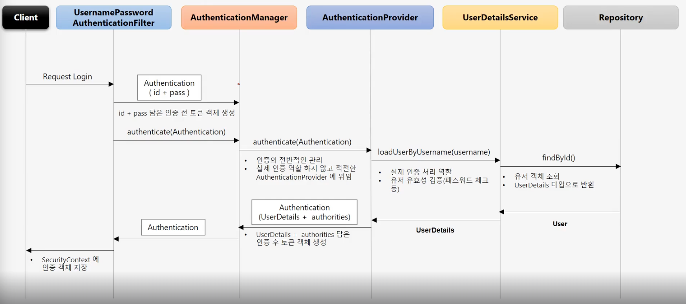
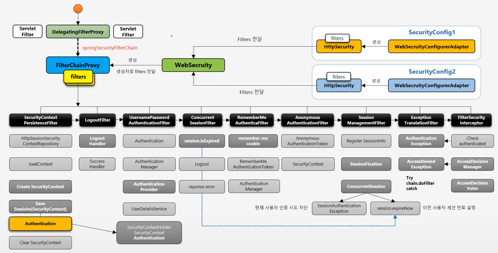

## DelegatingFilterProxy
- 서블릿 필터는 스프링에서 정의된 빈을 주입해서 사용할 수 없음
- 특정한 이름을 가진 스프링 빈을  찾아 그 빈에게 요청을 위임
  - springSecurityFilterChain 이름으로 생성된 빈을 ApplicationContext에서 찾아 요청을 위임
  - 실제 보안처리를 하지 않음

DelegatingFilterProxy는 서블릿 필터.

**FilterChainProxy**  
- springSecurityFilterChain 의 이름으로 생성되는 필터 빈
- DelegatingFilterProxy 로부터 요청을 위임 받고 실제 보안 처리
- 스프링 시큐리티 초기화 시 생성되는 필터들을 관리하고 제어
  - 스프링 시큐리티가 기본적으로 생성하는 필터
  - 설정 클래스에서 API 추가 시 생성되는 필터
- 사용자의 요청을 필터 순서대로 호출하여 전달
- 사용자정의 필터를 생성해서 기존의 필터 전후로 추가 가능
  - 필터의 순서를 정의
- 마지막 필터까지 인증 및 인가 예외가 발생하지 않으면 보안 통과


delegatingFilterProxy 에서 요청을 위임할 springSecurityFilterChain(FilterChaingProxy) 을 찾음

## 필터 초기화와 다중 보안 설정
- 설정 클래스 별로 보안 기능이 각각 작동
- 설정 클래스 별로 RequestMatcher 설정
  - http.antMatcher("/admin/**")
- 설정 클래스 별로 필터가 생성
- FilterChainProxy 가 각 필터들 가지고 있음
- 요청에 따라 RequestMatcher와 매칭되는 필터가 작동하도록 함

## Authentication
- 당신이 누구인 증명하는 것
  - 사용자의 인증 정보를 저장하는 토큰 개념
  - 인증 시 id, password를 담고 인증 검증을 위해 전달되어 사용된다.
  - 인증 후 최종 인증 결과(user 객체, 권한정보)를 담고 SecurityContext에 저장되어 전역적으로 참조가 가능하다.
    - ```java 
      Authentication authentication = SecurityContextHolder.getContext().getAuthentication() 
      ```
  - 구조
    - principal: 사용자 아이디 혹은 User 객체를 저장
    - credentials: 사용자 비밀번호
    - authorities: 인증된 사용자의 권한 목록
    - details: 인증 부가 정보
    - Authenticated: 인증 여부

### SecurityContext
- Authentication 객체가 저장되는 보관소로 필요 시 언제든지 Authentication 객체를 꺼내어 쓸 수 있도록 제공되는 클래스
- ThreadLocal에 저장되어 아무 곳에서나 참조가 가능하도록 설계함
- 인증이 완료되면 HttpSession에 저장되어 애플리케이션 전반에 걸쳐 전역적인 참조가 가능하다.

### SecurityContextHolder
- SecurityContext 객체 저장 방식
  - MODE_THREADLOCAL: 스레드당 SecurityContext 객체를 할당, 기본값
  - MODE_INHERITABLETHREADLOCAL: 메인 스레드와 자식 스레드에 관하여 동일한 SecurityContext를 유지
  - MODE_GLOBAL: 응용 프로그램에서 단 하나의 SecurityContext를 저장한다.
- SecurityContextHolder.clearContext(): SecurityContext 기존 정보 초기화

## SecurityContextPersistenceFilter
- SecurityCOntext 객체의 생성, 저장, 조회
- 익명사용자
  - 새로운 SecurityContext 객체를 생성하여 SecurityContextHolder에저장
  - AnonymousAuthenticationFilter에서 AnonymousAuthenticationToken 객체를 SecurityContext에 저장
- 인증 시
- 인증 후
- 최종 응답 시 공

## AuthenticationFlow


## AuthenticationManager
- AuthenticationProvider 목록 중에서 인증 처리 요건에 맞는 AuthenticationPRovider를 찾아 인증처리를 위임한다.
- 부모 ProviderManager를 설정하여 AuthenticationProvider를 계속 탐색할 수 있다.

여러 방식의 인증(Form 인증, RememberMe 인증, Oauth 인증)이 있다.
ProviderManager가 인증 처리를 AuthenticationProvider에게 위임한다.
본인이 가진 Provider 중에 인증을 처리할 수 있는게 없다면 다른 ProviderManager(부모)에게 위임한다.

AnonumousAuthenticationProvider는 디폴트로 생성됨

### AuthenticationProvider
ID, PW를 받아서 실제로 검증을 하는 객체

- ID 검증: UserDetailsService
  - 있으면 UserDetails를 반환
  - X: UserNotFoundException
- PW 검증
  - X: BadCredentialException
- 추가 검증
  - 인증 객체를 AuthenticationManager에게 전달 (역할 끝)

## Authorization
당신에게 무엇이 허가 되었는지 증명하는 것

스프링 시큐리티가 지원하는 권한 계층
- 웹 계층
  - URL 요청에 따른 메뉴 혹은 화면단위의 레벨 보안
- 서비스 계층
  - 화면 단위가 아닌 메소드 같은 기능 단위의 레벨 보안
- 도메인 계층(Access Control List, 접근 제어 목록)
  - 객체 단위의 레벨 보안

## FilterSecurityInterceptor
- 마지막에 위치한 필터로써 인증된 사용자에 대하여 특정 요청의 승인/거부 여부를 최종적으로 결정
- 인증 객체 없이 보호자원에 젖ㅂ근을 시도할 경우 AuthenticationException을 발생
- 인증 후 자원에 접근 가능한 권한이 존재하지 않을 경우 AccessDeniedExceptionㅇ르 발생
- 권한 제어 방식 중 HTTP 자원의 보안을 처리하는 필터
- 권한 처리를 AccessDecisionManager에게 맡김

## AccessDecisionManager
- 인증 정보, 요청 정보, 권한 정보를 이용해서 사용자의 자원접근을 허용할 것인지 거부할 것인지를 최종 결정하는 주체
- 여러 개의 Voter 들을 가질 수 있으며 Voter 들로부터 접근 허용, 거부, 보류에 해당하는 각각의 값을 리턴받고 판단 및 결정
- 최종 접근 거부 시 예외 발생

**접근 결정의 세가지 유형**
- AffirmativeBased
  - 하나라도 접근 허가하면 허가
- ConsensusBased
  - 다수결
- UnanimousBased
  - 만장일치

## AccessDecisionVoter
- 판단을 심사하는 것
- Voter가 권한 부여 과정에서 판단하는 자료
  - Authentication - 인증 정보
  - FilterInvocation - 요청 정보
  - ConfigAttributes - 권한 정보
- 결정 방식
  - ACCESS_GRANTED: 접근 허용  (1)
  - ACCESS_DENIED: 접근 거부 (-1)
  - ACCESS_ABSTAIN: 접근 보류 (0)

## 스프링 시큐리티 필터 및 아키텍처 정리!
