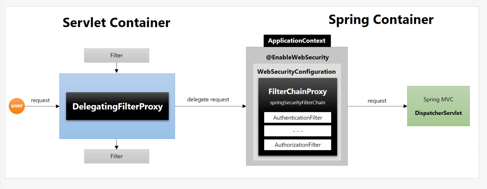

## DelegatingFilterProxy
- 서블릿 필터는 스프링에서 정의된 빈을 주입해서 사용할 수 없음
- 특정한 이름을 가진 스프링 빈을  찾아 그 빈에게 요청을 위임
  - springSecurityFilterChain 이름으로 생성된 빈을 ApplicationContext에서 찾아 요청을 위임
  - 실제 보안처리를 하지 않음

DelegatingFilterProxy는 서블릿 필터.

**FilterChainProxy**  
- springSecurityFilterChain 의 이름으로 생성되는 필터 빈
- DelegatingFilterProxy 로부터 요청을 위임 받고 실제 보안 처리
- 스프링 시큐리티 초기화 시 생성되는 필터들을 관리하고 제어
  - 스프링 시큐리티가 기본적으로 생성하는 필터
  - 설정 클래스에서 API 추가 시 생성되는 필터
- 사용자의 요청을 필터 순서대로 호출하여 전달
- 사용자정의 필터를 생성해서 기존의 필터 전후로 추가 가능
  - 필터의 순서를 정의
- 마지막 필터까지 인증 및 인가 예외가 발생하지 않으면 보안 통과

delegatingFilterProxy 에서 요청을 위임할 springSecurityFilterChain(FilterChaingProxy) 을 찾음

