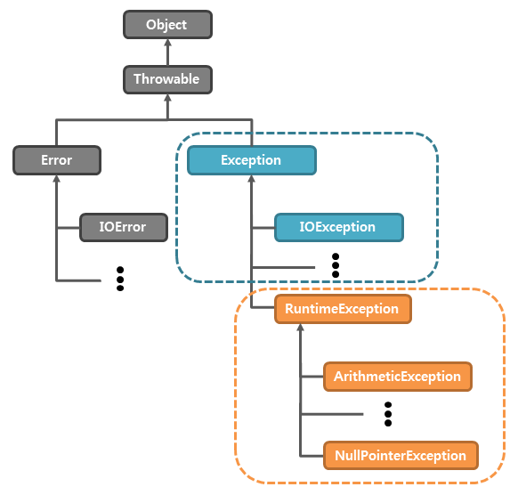

# 예외 처리가 필요한 이유
외부 서버와 통신할 때는 아양한 문제들이 발생한다.
- 외부 서버와 연결에 실패한다.
- 데이터 전송에 문제가 발생한다.

정상 코드 흐름과 예외 코드 흐름이 혼재돼있으면 코드를 파악하기가 쉽지 않다.

# 자바 예외 처리 - 예외 계층

- Throwable: 모든 예외의 최상위 클래스
- Error: 시스템에 뭔가 비정상적인 상황이 발생한 경우
  - 메모리 부족, 심각한 시스템 오류 등
- Exception: 체크 예외
  - 애플리케이션 로직에서 사용할 수 있는 실질적인 최상위 예외
- RuntimeException: 언체크 예외, 런타임 예외
  - 컴파일러가 체크하지 않는 언체크 예외

# 자바 예외 처리 - 예외 기본 규칙
예외는 폭탄 돌리기와 같다.
예외가 발생하면 잡아서 처리하거나, 처리할 수 없으면 밖으로 던져야 한다.
자바에서 main() 밖으로 예외ㅑ를 던지면 예외 로그를 출력하면서 시스템이 종료된다.

# 자바 예외 처리 - 체크 예외
Exception을 상속 받은 예외는 체크 예외가 된다.

체크 예외는 예외를 잡지 않고 밖으로 던지려면 throws 예외를 메서드에 필수로 선언해야 한다.
  
## 체크 예외의 장단점
- 장점: 개발자가 실수로 예외를 누락하지 않도록 컴파일러를 통해 문제를 잡아주는 훌륭한 안전 장치이다. 이를 통해 개발자는 어떤 체크 예외가 발생할 수 있는지 쉽게 파악할 수 있다.
- 단점: 예외를 처리하지 않으면 컴파일이 되지 않는다. 이로 인해 코드가 복잡해지고, 예외 처리를 강제하기 때문에 코드가 더 복잡해진다.

# 자바 예외 처리 - 언체크 예외
- RuntimeException을 상속 받은 예외는 언체크 예외가 된다.
- 언체크 예외는 예외를 잡지 않아도 된다.

## 언체크 예외의 장단점
- 장점: 신경쓰고 싶지 않은 언체크 예외를 무시할 수 있다.
- 단점: 언체크 예외는 개발자가 실수로 예외를 누락할 수 있다.
