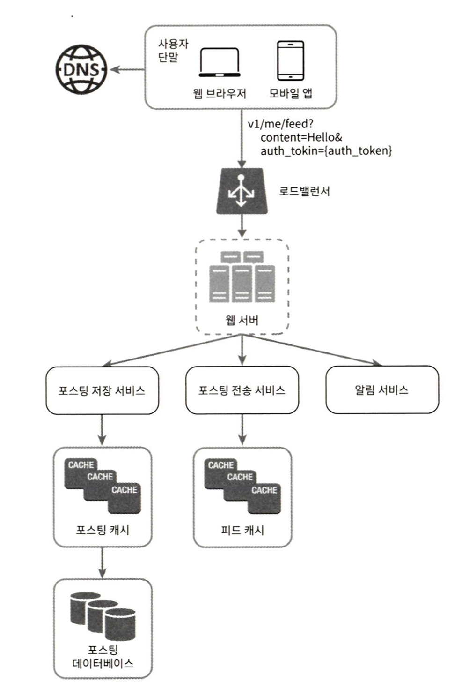
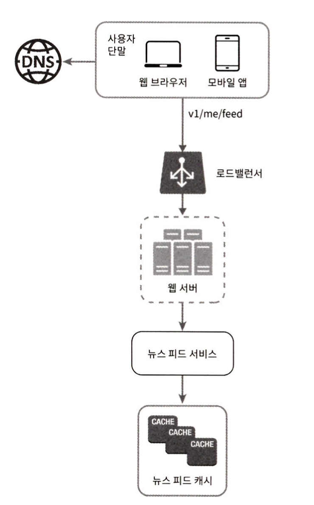
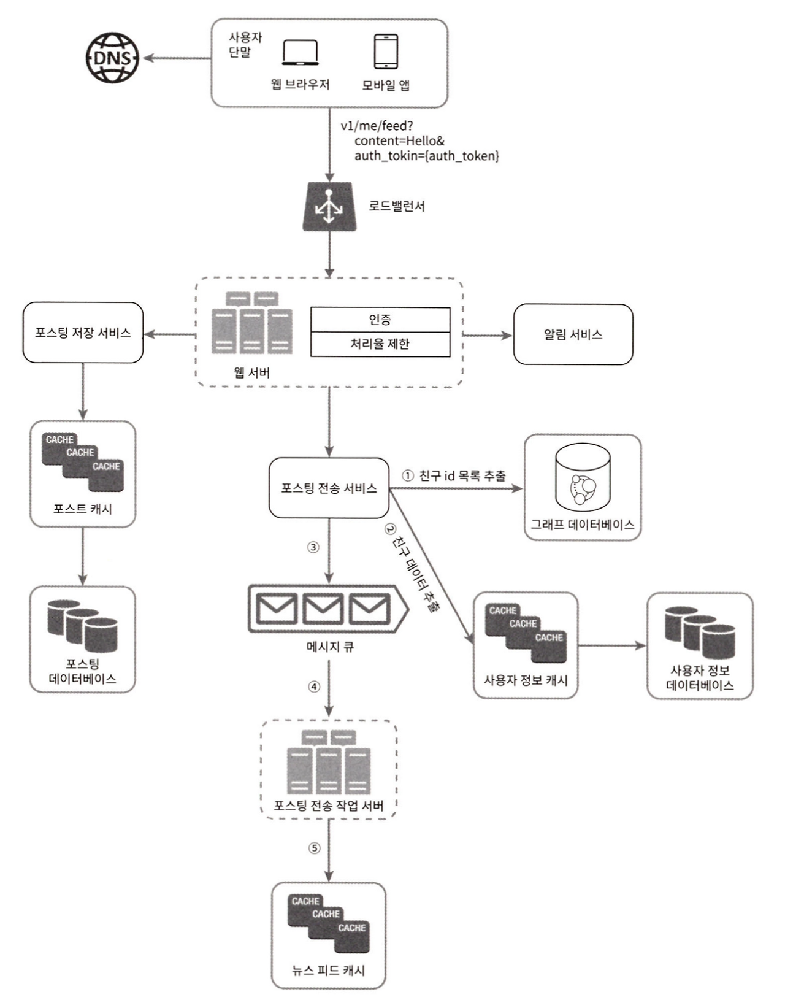
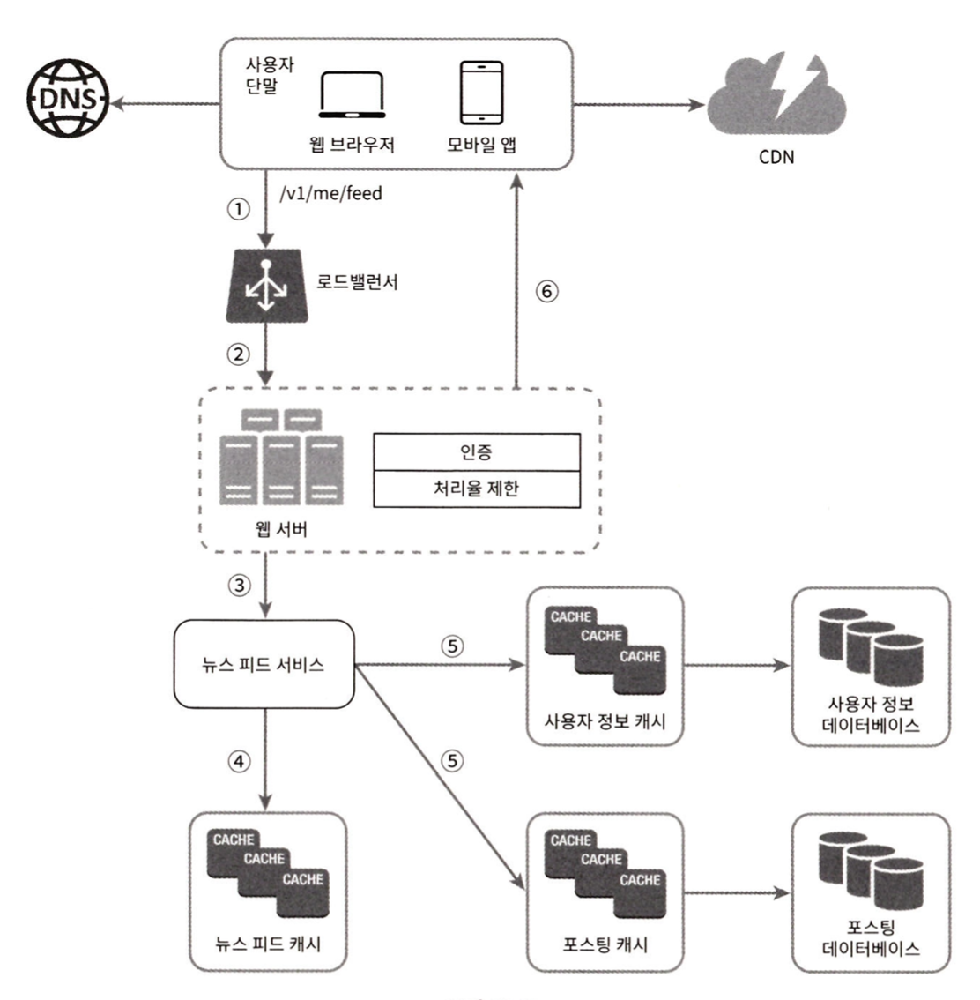

페이스북의 도움말 페이지는, "뉴스 피드는 여러분의 홈 페이지 중앙에 지속적으로 업데이트되는 스토리들로, 사용자 상태 정보 업데이트, 
사진, 비디오, 링크, 앱 활동(app activity), 그리고 여러분이 페이스북에서 팔로하는 사람들, 페이지 등을 포함한다"고 설명하고 있다.

## 1단계 문제 이해 및 설계 범위 확정
- 지원자: 모바일 앱을 위한 시스템인가요? 아니면 웹? 둘 다 지원해야 합니까?
- 면접관: 둘 다 지원해야 합니다.
- 지원자: 중요한 기능으로는 어떤 것이 있을까요?
- 면접관: 사용자는 뉴스 피드 페이지에 새로운 스토리를 올릴 수 있어야 하고, 친구들이 올리는 스토리를 볼 수도 있어야 합니다.
- 지원자: 뉴스 피드에는 어떤 순서로 스토리가 표시되어야 하나요?
- 면접관: 단순 시간 흐름 역순으로 표시된다고 가정합시다.
- 지원자: 한 명의 사용자는 최대 몇 명의 친구를 가질 수 있습니까?
- 면접관: 5,000명입니다.
- 지원자: 트래픽 규모는 어느 정도입니까?
- 면접관: 매일 천만 명이 방문한다고 가정합시다.
- 지원자: 피드에 이미지나 비디오 스토리도 올라올 수 있습니까?
- 면접관: 스토리에는 이미지나 비디오 등의 미디어 파일이 포함될 수 있습니다.

## 2단계 개략적 설계안 제시 및 동의 구하기
- 피드 발행: 사용자가 스토리를 포스팅하면 해당 데이터를 캐시와 데이터베이스에 기록한다. 새 포스팅은 친구의 뉴스 피드에도 전송된다.
- 뉴스 피드 생성: 지면 관계상 뉴스 피드는 모든 친구의 포스팅을 시간 흐름 역순으로 모아서 만든다고 가정한다.

### 뉴스 피드 API
뉴스 피드 API는 클라이언트가 서버와 통신하기 위해 사용하는 수단이다.
HTTP 프로토콜 기반이고, 상태 정보를 업데이트하거나, 뉴스 피드를 가져오거나,
친구를 추가하는 등의 다양한 작업을 수행하는 데 사용한다.

**피드 발행 API**  
```http request
POST /v1/me/feed
```
인자:
- 바디: 포스팅 내용에 해당한다.
- Authorization gㅔ더: API 호출을 인증하기 위해 사용한다.

**피드 읽기 API**  
뉴스 피드를 가져오는 API다.
```http request
GET /v1/me/feed
```
인자:
- Authorization 헤더: API 호출을 인증하기 위해 사용한다.

## 피드 발행

- 사용자: 모바일 앱이나 브라우저에서 새 포스팅을 올리는 주체다. POST /v1/me/feed API를 사용한다.
- 로드밸런서(load balancer): 트래픽을 웹 서버들로 분산한다.
- 웹 서버: HTTP 요청을 내부 서비스로 중계하는 역할을 담당한다.
- 포스팅 저장 서비스: 새 포스팅을 데이터베이스와 캐시에 저장한다.
- 포스팅 전송 서비스: 새 포스팅을 친구의 뉴스 피드에 푸시한다. 뉴스 피드 데이터는 캐시에 보관하여 빠르게 읽어갈 수 있도록 한다.
- 알림 서비스: 친구들에게 새 포스팅이 올라왔음을 알리거나, 푸시 알림을 보내는 역할을 담당한다.

## 뉴스 피드 생성

- 사용자: 뉴스 피드를 읽는 주체다. GET /v1/me/feed API를 이용한다.
- 로드 밸런서: 트래픽을 웹 서버들로 분산한다.
- 웹 서버: 트래픽을 뉴스 피드 서비스로 보낸다.
- 뉴스 피드 서비스: 캐시에서 뉴스 피드를 가져오는 서비스다.
- 뉴스 피드 캐시: 뉴스 피드를 렌더링할 때 필요한 피드 ID를 보관한다.

## 3단계 상세 설계

### 피드 발행 흐름 상세 설계
**웹 서버**  
웹 서버는 클라이언트와 통신할 뿐 아니라 인증이나 처리율 제한 등의 기능도 수행한다.
올바른 인증 토큰을 Authorization 헤더에 넣고 API를 호출하는 사용자만 포스팅을 할 수 있어야 한다.
스팸 방지를 위해 특정 기간 동안 한 사용자가 올릴 수 있는 포스팅의 수에 제한을 두어야 한다.

**포스팅 전송(팬아웃) 서비스**  
포스팅 전송, 즉 팬아웃은 어떤 사용자의 새 포스팅을 그 사용자와 친구 관계에 있는 모든 사용자에게 전달하는 과정이다.
팬아웃에는 두 가지 모델이 있는데 하나는 쓰기 시점에 팬아웃(fanout-on-write)하는 모델이고,
다른 하나는 읽기 시점에 팬아웃(fanout-on-read)하는 모델이다.

### 쓰기 시점에 팬아웃하는 모델  
새로운 포스팅을 기록하는 시점에 뉴스피드를 갱신하게 된다.

**장점**  
- 뉴스 피드가 실시간으로 갱신되며 친구 목록에 있는 사용자에게 즉시 전송된다.
- 새 포스팅이 기록되는 순간에 뉴스 피드가 이미 갱신되므로(pre-computed) 뉴스 피드를 읽는 데 드는 시간이 짧아진다.

**단점**  
- 친구가 많은 사용자의 경우 친구 목록을 가져오고 그 목록에 있는 사용자 모두의 뉴스 피드를 갱신하는 데 많은 시간이 소요될 수도 있다.
핫키(hotkey)라고 부르는 문제다.
- 서비스를 자주 이용하지 않는 사용자의 피드까지 갱신해야 하므로 컴퓨팅 자원이 낭비된다.

### 읽기 시점에 팬아웃하는 모델
피드를 읽어야 하는 시점에 뉴스 피드를 갱신한다.
따라서 요청 기반(on-demand) 모델이다.
사용자가 로딩하는 시점에 새로운 포스트를 가져오게 된다.

**장점**  
- 비활성화된 사용자, 또는 서비스에 거의 로그인하지 않는 사용자의 경우에는 이 모델이 유리하다.
로그인하기까지는 어떤 컴퓨팅 자원도 소모하지 않아서다.
- 데이터를 친구 각각에 푸시하는 작업이 필요 없으므로 핫키 문제도 생기지 않는다.

**단점**  
- 뉴스 피드를 읽는 데 많은 시간이 소요될 수 있다.

본 설계안의 경우는 두 장점을 결합하도록 하겠다.
뉴스 피드를 빠르게 가져올 수 있도록 하는 것은 아주 중요하므로 대부분의 사용자에 대해서는 푸시 모델을 사용한다.
친구나 팔로워(follower)가 아주 많은 사용자의 경우에는 팔로워로 하여금 해당 사용자의 포스팅을 필요할 때 가져가도록 하는 풀 모델을 사용하여 시스템 과부하를 방지할 것이다.

아울러 안정 해시(consistent hashing)를 통해 요청과 데이터를 보다 고르게 분산하여 핫키 문제를 줄여볼 것이다.

**팬아웃 서비스**
1. 그래프 데이터베이스에서 친구 ID 목록을 가져온다.
2. 사용자 정보 캐시에서 친구들의 정보를 가져온다.
3. 친구 목록과 새 스토리의 포스팅 ID를 메시지 큐에 넣는다.
4. 팬아웃 작업 서버가 메시지 큐에서 데이터를 꺼내어 뉴스 피드 데이터를 뉴스 피드 캐시에 넣는다.

### 피드 읽기 흐름 상세 설계

1. 사용자가 뉴스 피드를 읽으려는 요청을 보낸다.
2. 로드밸런서가 요청을 웹 서버 가운데 하나로 보낸다.
3. 웹 서버는 피드를 가져오기 위해 뉴스 피드 서비스를 호출한다.
4. 뉴스 피드 서비스는 뉴스 피드 캐시에서 포스팅 ID 목록을 가져온다.
5. 뉴스 피드에 표시할 사용자 이름, 사용자 사진, 포스팅 콘텐츠, 이미지 등을 사용자 캐시와 포스팅 캐시에서 가져와 완전한 뉴스 피드를 만든다.
6. 생성된 뉴스 피드를 JSON 형태로 클라이언트에게 보낸다. 클라이언트는 해당 피드를 렌더링한다.

### 캐시 구조
- 뉴스 피드: 뉴스 피드의 ID를 보관한다.
- 콘텐츠: 포스팅 데이터를 보관한다. 인기 콘텐츠는 따로 보관한다.
- 소셜 그래프: 사용자 간 관계 정보를 보관한다.
- 행동(action): 포스팅에 대한 사용자의 행위에 관한 정보를 보관한다.
- 횟수(counter): '좋아요' 횟수, 응답 수, 팔로워 수, 팔로잉 수 등의 정보를 보관한다.

## 4단계 마무리
**추가 논의점**

**데이터베이스 규모 확장**
- 수직적 규모 확장 vs 수평적 규모 확장
- SQL vs NoSQL
- 주-부(master-slave) 다중화
- 복제본(replica)에 대한 읽기 연산
- 일관성 모델(consistency model)
- 데이터베이스 샤딩(sharding)

**이 외**
- 웹 계층을 무상태로 운영하기
- 가능한 한 많은 데이터를 캐시할 방법
- 여러 데이터 센터를 지원할 방법
- 메시지 큐를 사용하여 컴포넌트 사이의 결합도 낮추기
- 핵심 메트릭에 대한 모니터링