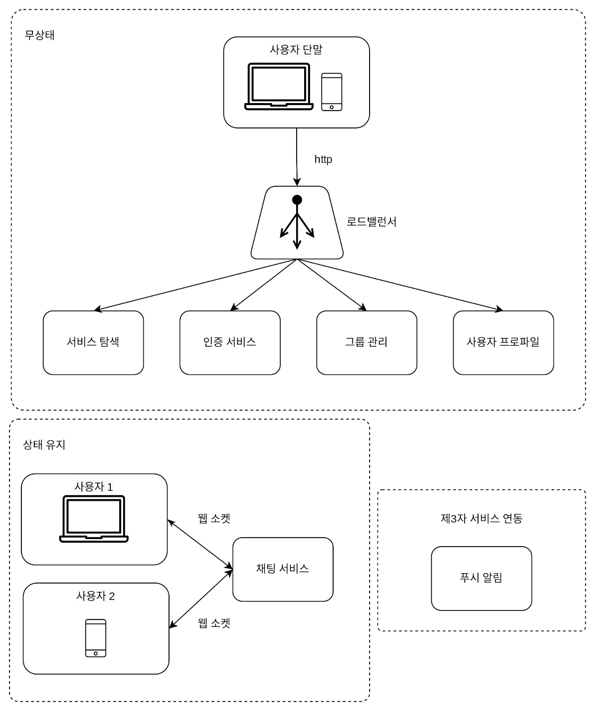

## 1단계 문제 이해 및 설계 범위 확정
페이스북 메신저, 위칫, 왓츠앱처럼 1:1 채팅에 집중하는 앱들이 있는가 하면
슬랙(Slack)같은 그룹 채팅에 중점을 둔 업무용 앱이나, 
게임 채팅에 쓰이는 디스코드(Discord) 같이 대규모 그룹의 소통과 응답지연(latency)이 낮은 음성 채팅에 집중하는 앱도 있다.

따라서 초반에 면접관이 원하는 앱이 정확히 무엇인지 알아내는게 좋다.

- 지원자: 어떤 앱을 설계해야 하나요?
- 면접관: 1:1, 그룹 채팅을 둘 다 지원할 수 있어야 합니다.
- 지원자: 모바일 앱인가요 아니면 웹 앱인가요?
- 면접관: 둘 다입니다.
- 지원자: 처리해야 하는 트래픽 규모는 어느 정도입니까?
- 면접관: 일별 능동 사용자 수(DAY: Daily Active User) 기준으로 5천만명을 처리할 수 있어야 합니다.
- 지원자: 그룹 채팅의 경우에 인원 제한이 있습니까?
- 면접관: 최대 100명까지 참가할 수 있습니다.
- 지원자: 중요 기능으로는 어떤 것이 있을까요?
- 면접관: 1:1 채팅, 그룹 채팅, 사용자 접속상태 표시를 지원해야 합니다. 텍스트 메시지만 주고받을 수 있습니다.
- 지원자: 메시지 길이에 제한이 있나요?
- 면접관: 100,000자 이하여야 합니다.
- 지원자: 종단 간 암호화(end-to-end encryption)를 지원해야 하나요?
- 면접관: 현재로서는 필요 없습니다만 추후에 논의해볼 수 있습니다.
- 지원자: 채팅 이력은 얼마나 오래 보관해야 할까요?
- 면접관: 영원히요.

**요구사항**
- 응답지연이 낮은 일대일 채팅
- 최대 100명까지 참여할 수 있는 그룹 채팅 기능
- 사용자의 접속상태 표시 기능
- 다양한 단말 지원. 하나의 계정으로 여러 단말에 동시 접속 지원
- 푸시 알림

## 2단계 개략적 설계안 제시 및 동의 구하기
**기본 기능**
- 클라이언트들로부터 메시지 수신
- 메시지 수신자 결정 및 전달
- 수신자가 접속 상태가 아닌 경우에는 접속할 때까지 해당 메시지 보관

송신 클라이언트는 메시지를 보낼 때 HTTP 프로토콜을 사용한다.
채팅 서비스와의 접속에는 keep-alive 헤더를 사용하면 효율적인데, 클라이언트와 서버 사이의 연결을 끊지 않고 계속 유지할 수 있어서다.
TCP 접속 과정에서 발생하는 핸드셰이크 횟수를 줄일 수 있음은 물론이다.
HTTP는 메시지 전송 용도로는 괜찮은 선택이다.

하지만 메시지 수신 시나리오는 이것보다 복잡하다.
HTTP는 클라이언트가 연결을 만드는 프로토콜이며, 서버에서 클라이언트로 임의 시점에 메시지를 보내는 데는 쉽게 쓰일 수 없다.
서버가 연결을 만드는 것처럼 동작할 수 있도록 하기 위해 많은 기법이 제안되어 왔는데, 폴링(polilng), 롱폴링(long polling),
웹소켓(WebSocket) 등이 그런 기술이다.

### 폴링
폴링은 클라이언트가 주기적으로 서버에게 새 메시지가 있냐고 물어보는 방식이다.
답해줄 메시지가 없는 경우에는 서버 자원이 불필요하게 낭비된다는 문제도 있다.

### 롱 폴링
롱 폴링의 경우 클라이언트는 새 메시지가 반환되거나 타임아웃 될 때까지 연결을 유지한다.
클라이언트는 새 메시지를 받으면 기존 연결을 종료하고 서버에 새로운 요청을 보내어 모든 절차를 다시 시작한다.

**약점**  
- 메시지를 보내는 클라이언트와 수신하는 클라이언트가 같은 채팅 서버에 접속하게 되지 않을 수도 있다.
- 서버 입장에서는 클라이언트가 연결을 해제했는지 아닌지 알 좋은 방법이 없다.
- 여전히 비효율적이다. 메시지를 많이 받지 않는 클라이언트도 타임아웃이 일어날 때마다 주기적으로 서버에 다시 접속할 것이다.

### 웹소켓
웹소켓(WebSocket)은 서버가 클라이언트에게 비동기(async) 메시지를 보낼 떄 가장 널리 사용하는 기술이다.
웹소켓 연결은 클라이언트가 시작한다.
한번 맺어진 연결은 항구적이며 양방향이다.
이연결은 처음에는 HTTP 연결이지만 특정 핸드셰이크 절차를 거쳐 웹소켓 연결로 업그레이드된다.
일단 이 항구적인 연결이 만들어지고 나면 서버는 클라이언트에게 비동기적으로 메시지를 전송할 수 있다.
웹소켓은 일반적으로 방화벽이 있는 환경에서도 잘 동작한다.
80이나 443처럼 HTTP 혹은 HTTPS 프로토콜이 사용하는 기본 포트번호를 그대로 쓰기 때문이다.

웹소켓을 이용하면 메시지를 보낼 때나 받을 때 동일한 프로토콜을 사용할 수 있으므로 설계뿐 아니라 구현도 단순하고 직관적이다.
유의할 것은 웹소켓 연결은 항구적으로 유지되어야 하기 때문에 서버 측에서 연결 관리를 효율적으로 해야 한다는 것이다.

### 개략적 설계안
채팅 시스템은 세 부분으로 나누어 볼 수 있다.
무상태 서비스, 상태유지 서비스, 그리고 제 3자 서비스 연동의 세 부분으로 나누어 살펴볼 수 있다.

**무상태 서비스**  
무상태 서비스는 로그인, 회원가입, 사용자 프로파일 표시 등을 처리하는 전통적인 요청/응답 서비스다.

**상태 유지 서비스**  
본 설계안에서 유일하게 상태 유지가 필요한 서비스는 채팅 서비스다.
각 클라이언트가 채팅 서버와 독립적인 네트워크 연결을 유지해야 하기 때문이다.
클라이언트는 보통 서버가 살아 있는 한 다른 서버로 연결을 변경하지 않는다.
서비스 탐색 서비스는 채팅 서비스와 긴밀히 협력하여 특정 서버에 부하가 몰리지 않도록 한다.

**제3자 서비스 연동**
채팅 앱에서 가장 중요한 제3자 서비스는 푸시 알림이다.
새 메시지를 받았다면 설사 앱이 실행 중이지 않더라도 알림을 받아야 해서다.

**규모 확장성**  
이번 장에서 다루는 시스템의 경우에는 동시 접속자가 1M이라고 가정할 것인데, 
접속당 10K의 서버 메모리가 필요하다고 본다면(아주 개략적으로 추정한 수치이고 프로그래밍 언어에 따라 달라질 수 있다) 10GB 메모리만 있으면 모든 연결을 다 처리할 수 있을 것이다.

하지만 모든 것을 한 대에 담은 설계안을 내밀면 면접에서 좋은 점수를 따긴 어려울 것이다.
이정도의 트래픽을 한 대로 처리하는 것도 좋지 않고, SPOF도 그 이유 중 한다.
- 채팅 서버는 클라이언트 사이에 메시지를 중계하는 역할을 담당한다.
- 접속상태 서버(presence server)는 사용자의 접속 여부를 관리한다.
- API 서버는 로그인, 회원가입, 프로파일 변경 등 그 외 나머지 전부를 처리한다.
- 알림 서버는 푸시 알림을 보낸다.
- 키-값 저장소(key-value store)에는 채팅 이력(chat history)을 보관한다.

**저장소**  
채팅 시스템이 다루는 데이터는 보통 두 가지다.
첫 번째는 사용자 프로파일, 설정, 친구 목록처럼 일반적인 데이터다.
이런 데이터는 안정성을 보장하는 관계형 데이터베이스에 보관한다.
다중화(replication)와 샤딩(sharding)은 이런 데이터의 가용성과 규모확장성을 보증하기 위해 보편적으로 사용되는 기술이다.

두 번쨰 유형의 데이터는 채팅 시스템에 고유한 데이터로, 바로 채팅 이력이다. 이 데이터를 어떻게 보관할지 결정하려면 읽기/쓰기 연산 패턴을 이해해야 한다.
- 채팅 이력 데이터의 양은 엄청나다. 페이스북 메신저는 매일 600억 개의 메시지를 처리한다.
- 이 데이터 가운데 빈번하게 사용되는 것은 주로 최근에 주고받은 메시지다.
- 사용자는 대체로 최근에 주고받은 메시지 데이터만 보게 되는 것이 사실이나, 검색 기능을 이용하거나, 특정 사용자가 언급(mention)된 메시지를 보거나,
특정 메시지로 점프하거나 하여 무작위적인 데이터 접근을 하게 되는 일도 있다. 데이터 계층은 이런 기능도 지원해야 한다.
- 1:1 채팅 앱의 경우 읽기:쓰기 비율은 대략 1:1 정도다.

본 설계안의 경우에는 키-값 저장소를 추천할 것인데, 그 이유는 다음과 같다.
- 키-값 저장소는 수평적 규모확장(horizontal scaling)이 쉽다.
- 키-값 저장소는 데이터 접근 지연시간(latency)이 낮다.
- 관계형 데이터베이스는 데이터 가운데 롱 테일에 해당하는 부분을 잘 처리하지 못하는 경향이 있다. 
인덱스가 커지면 데이터에 대한 무작위적 접근(random access)을 처리하는 비용이 늘어난다.
- 페이스북 메신저다 디스코드가 키-값 저장소를 채택하고 있다.

### 데이터 모델
**1:1 채팅을 위한 메시지 테이블**  
- message_id
- message_from
- message_to
- content
- created_at

**그룹 채팅을 위한 메시지 테이블**  
- channel_id
- message_id
- message_to
- content
- created_at

channel_id는 파티션 키로도 사용할 것인데, 그룹 채팅에 적용될 모든 질의는 특정 채널을 대상으로 할 것이기 때문이다.

**메시지 ID**  
- message_id의 값은 고유해야 한다.
- ID 값은 정렬 가능해야 하며 시간 순서와 일치해야 한다. 

스노플레이크 같은 전역적 64bit 순서 번호 생성기를 이용해서 message_id를 만들 수 있다.

## 3단계 상세 설계
### 서비스 탐색
서비스 탐색 기능의 주된 역할은 클라이언트에게 가장 적합한 채팅 서버를 추천하는 것이다.
이때 사용되는 기준으로는 클라이언트의 위치(geographical location), 서버의 용량(capacity) 등이 있다.
사용 가능한 모든 채팅 서버를 여기 등록시켜 두고, 클라이언트가 접속을 시도하면 사전에 정한 기준에 따라 최적의 채팅 서버를 골라 주면 된다.

1. 사용자 A가 시스템에 로그인을 시도한다.
2. 로드밸런서가 로그인 요청을 API 서버들 가운데 하나로 보낸다.
3. API 서버가 사용자 인증을 처리하고 나면 서비스 탐색 기능이 동작하여 해당 사용자를 서비스할 최적의 채팅 서버를 찾는다.
4. 사용자는 채팅서버와 웹소켓 연결을 맺는다.

### 메시지 흐름
**1:1 채팅 메시지 처리 흐름**

1. 사용자 A가 채팅서버 1로 메시지 전송
2. 채팅 서버 1은 ID 생성기를 사용해 해당 메시지의 ID 결정
3. 채팅 서버 1은 해당 메시지를 메시지 동기화 큐로 전송
4. 메시지가 키-값 저장소에 보관됨
5. (a) 사용자 B가 접속 중인 경우 메시지는 사용자 B가 접속중인 채팅서버로 전송됨
   (b) 사용자 B가 접속 중이 아니라면 푸시 알림 메시지를 푸시 알림 서버로 보냄
6. 채팅 서버 2는 메시지를 사용자 B에게 전송. 사용자 B와 채팅 서버 2 사이에는 웹소켓 연결이 있는 상태이므로 그것을 이용

**여러 단말 사이의 메시지 동기화**    
각 단말은 cur_max_message_id라는 변수를 유지하는데, 해당 단말에서 관측된 가장 최신 메시지의 ID를 추적하는 용도다.
아래 두 조건을 만족하는 메시지는 새 메시지로 간주한다.
- 수신자 ID가 현재 로그인한 사용자 ID와 같다.
- 키-값 저장소에 보관된 메시지로서, 그 ID가 cur_max_message_id보다 크다.

cur_max_message_id는 단말마다 별도로 유지 관리하면 되는 값이라 키-값 저장소에서 새 메시지를 가져오는 동기화 작업도 쉽게 구현할 수 있다.

**소규모 그룹 채팅에서의 메시지 흐름**  

사용자 A가 보낸 메시지가 사용자 B와 C의 메시지 동기화 큐에 복사된다.
이 큐를 사용자 각각에 할당된 메시지 수신함 같은 것으로 생각해도 무방할 것이다.
이 설계안은 소규모 그룹 채팅에 적합하다.
- 새로운 메시지가 왔는지 확인하려면 자기 큐만 보면 되니까 메시지 동기화 플로가 간단하다.
- 그룹이 크지 않으면 메시지를 수신자별로 복사해서 큐에 넣는 작업의 비용이 문제가 되지 않는다.

하지만 많은 사용자를 지원해야 하는 경우라면 똑같은 메시지를 모든 사용자의 큐에 복사하는게 바람직하지 않을 것이다.
따라서 각 사용자의 수신함, 즉 메시지 동기화 큐는 여러 사용자로부터 오는 메시지를 받을 수 있어야 한다.

### 접속 상태 표시
**사용자 로그인**  
웹소켓 연결이 맺어지고 나면 접속상태 서버는 사용자의 상태와 last_active_at 타임스탬프 값을 키-값 저장소에 보관한다.

**로그아웃**  
키-값 저장소에 보관된 사용자 상태가 online에서 offline으로 바뀌게 된다.

**접속 장애**  
사용자의 인터넷 연결이 끊어지면 클라이언트와 서버 사이에 맺어진 웹소켓 같은 지속성 연결도 끊어진다.
이런 장애에 대응하는 간단한 방법은 사용자를 오프라인 상태로 표시하고 연결이 복구되면 온라인 상태로 변경하는 것이다.
하지만 이 방법에는 심각한 문제가 있다. 짧은 시간 동안 인터넷 연결이 끊어졌다 복구되는 일은 흔하다.

본 설계안에서는 박동(heatbeat) 검사를 통해 이 문제를 해결할 것이다.
즉, 온라인 상태의 클라이언트로 하여금 주기적으로 박동 이벤트(heartbeat event)를 접속상태 서버로 보내도록 하고,
마지막 이벤트를 받은 지 x초 이내에 또 다른 박동 이벤트 메시지를 받으면 해당 사용자의 접속상태를 계속 온라인으로 유지하는 것이다.

**상태 정보의 전송**  
상태 정보 서버는 발행-구독 모델(publish-subscribe model)을 사용하는데, 즉 각각의 친구관계마다 채널을 하나씩 두는 것이다.
가령 A의 접속 상태가 변경되었다고 하자. 그 사실을 세 개 채널, 즉 A-B, A-C, A-D에 쓰는 것이다.
이 방안은 그룹 크기가 작을 때는 효과적이다. 하지만 그룹의 크기가 커지면 좋지 않다.

이런 성능 문제를 해소하는 한 가지 방법은 사용자가 그룹 채팅에 입장하는 순간에만 상태 정보를 읽어가게 하거나, 
친구 리스트에 있는 사용자의 접속상태를 갱신하고 싶으면 수동으로 하도록 유도하는 것이다.

### 4단계 마무리
**추가 논의점**  
- 미디어를 지원하도록 하는 방법
  - 압축 방식, 클라우드 저장소, 섬네일 생성
- 종단 간 암호화
- 캐시
- 로딩 속도 개선
- 오류 처리
  - 채팅 서버 오류
  - 메시지 재전송
