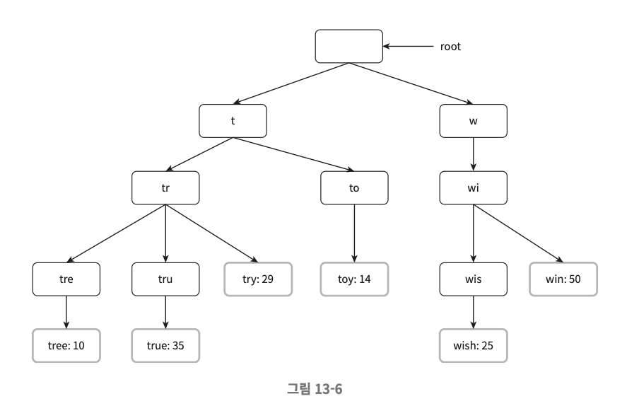

검색창에 입력 중인 글자에 맞는 검색어가 자동으로 완성되어 표시되는 것을 볼 수 있다.
이런 기능은 보통 검색어 자동완성(autocomplete, typeahead, search-as-you-type, incremental search)이라 부른다.
이번 장에는 많이 이용된 검색어 k개를 자동완성하여 출력하는 시스템을 설계해 보도록 하겠다.

## 1단계 문제 이해 및 설계 범위 확정
- 지원자: 사용자가 입력하는 단어는 자동완성될 검색어의 첫 부분이어야 하나요? 아니면 중간 부분이 될 수도 있습니까?
- 면접관: 첫 부분으로 한정하겠습니다.
- 지원자: 몇 개의 자동완성 검색어가 표시되어야 합니까?
- 면접관: 5개
- 지원자: 5개를 고르는 기준은 무엇입니까?
- 면접관: 질의 빈도에 따라 정해지는 검색어 인기 순위
- 지원자: 맞춤법 검사 기능도 제공해야 합니까?
- 면접관: NO, 맞춤법 검사나 자동수정은 지원하지 않습니다.
- 지원자: 질의는 영어입니까?
- 면접관: YES, 그러나 시간이 된다면 다국어 지원을 생각해도 좋습니다.
- 지원자: 대문자나 특수 문자 처리도 해야 합니까?
- 면접관: NO. 영어 소문자로 이루어진다고 가정
- 지원자: 얼마나 많은 사용자를 지원해야 합니까?
- 면접관: 일간 능동 사용자(DAU) 기준으로 천만(10million) 명입니다.

### 요구 사항
- 빠른 응답 속도: 100ms 이내
- 연광성: 자동완성되어 출력되는 검색어는 사용자가 입력한 단어와 연관된 것이어야 한다.
- 정렬: 순위 모델에 의해 정렬되어 있어야 한다.
- 규모 확장성
- 고가용성

### 개략적 규모 추정
- DAU 천만 명
- 평균적으로 한 사용자가 매일 10건의 검색을 수행한다고 가정
- 질의할 때마다 평균적으로 20바이트의 데이터를 입력한다고 가정한다.
  - 문자 인코딩 방법으로는 ASCII를 사용한다고 가정할 것이므로, 1문자=1바이트이다.
  - 질의문은 평균적으로 4개 단어로 이루어진다고 가정할 것이며, 각 단어는 평균적으로 다섯 글자로 구성된다고 가정할 것이다.
- 검색창에 글자를 입력할 때마다 클라이언트는 검색어 자동완성 백엔드에 요청을 보낸다. 
따라서 평균 1화 검색당 20건의 요청이 백엔드로 전달된다.
- 대략 초당 24,000 건의 질의(QPS)가 발생할 것이다.
- 최대 QPS = QPS * 2 = 대략 48,000
- 질의 가운데 20% 정도는 신규 검색어라고 가정할 것이다. 따라서 대략 0.4GB 정도다. 매일 0.4GB의 신규 데이터가 시스템에 추가된다는 뜻이다.

## 2단계 개략적 설계안 제시 및 동의 구하기
개략적으로 시스템은 두 부분으로 나뉜다.
- 데이터 수집 서비스(data gathering service): 사용자가 입력한 질의를 실시간으로 수집하는 시스템
데이터가 많은 애플리케이션에 실시간 시스템은 그다지 바람직하지 않지만 설계안을 만드는 출발점으로는 괜찮을 것이다.
- 질의 서비스(query service): 주어진 질의에 다섯 개의 인기 검색어를 정렬해 내놓는 서비스이다.

### 데이터 수집 서비스  
질의문과 사용빈도를 저장하는 빈도 테이블(frequency table)이 있다고 가정하겠다.

### 질의 서비스
- query: 질의문을 저장하는 필드다.
- frequency: 질의문이 사용된 빈도를 저장하는 필드다.
```sql
SELECT * FROM frequency_table
WHERE query Like 'prefix%'
ORDER BY frequency DESC
LIMIT 5
```

## 3단계 상세 설계
- 트라이(trie) 자료구조
- 데이터 수집 서비스
- 질의 서비스
- 규모 확장이 가능한 저장소
- 트라이 연산

### 트라이 자료구조
트라이는 문자열들을 간략하게 저장할 수 있는 자료구조다. 
트라이라는 이름은 "retrieval"이라는 단어에서 온 것인데, 문자열을 꺼내는 연산에 초점을 맞추어 설계된 자료구조임을 미루어 짐작할 수 있다.

**트라이 자료구조의 핵심 아이디어**
- 트라이는 트리 형태의 자료구조다.
- 이 트리의 루트 노드는 빈 문자열을 나타낸다.
- 각 노드는 글자(character) 하나를 저장하며, 26개(해당 글자 다음에 등장할 수 있는 모든 글자의 개수)의 자식 노드를 가질 수 있다.
- 각 트리 노드는 하나의 단어, 또는 접두어 문자열(prefix string)을 나타낸다.


기본 트라이 자료구조는 노드에 문자들을 저장한다.
이용 빈도에 따라 정렬된 결과를 내놓기 위해서는 노드에 빈도 정보까지 저장할 필요가 있다.
- p: 접두어(prefix)의 길이
- n: 트라이 안에 있는 노드 개수
- c: 주어진 노드의 자식 노드 개수

가장 많이 사용된 질의어 k개는 다음과 같이 찾을 수 있다.
- 해당 접두어를 표현하는 노드를 찾는다. 시간 복잡도는 O(p)이다.
- 해당 노드부터 시작하는 하위 트리를 탐색하여 모든 유효 노드를 찾는다.
유효한 검색 문자열을 구성하는 노드가 유효 노드다. 시간 복잡도는 O(c)이다.
- 유효 노드들을 정렬하여 가장 인기 있는 검색어 k개를 찾는다. 시간 복잡도는 O(clogc)이다.

이 알고리즘은 직관적이지만 최악의 경우에는 k개 결과를 얻으려고 전체 트라이를 다 검색해야 하는 일이 생길 수 있다.
이 문제를 해결할 방법으로는 다음의 두 가지가 있다.

1. 접두어의 최대 길이를 제한
2. 각 노드에 인기 검색어를 캐시

**접두어 최대 길이 제한**  
사용자가 검색창에 긴 검색어를 입력하는 일은 거의 없다.
따라서 p값은 작은 정숫값(가령 50 같은)이라고 가정해도 안전하다.
최대 길이를 제한할 수 있다면 O(1)로 바뀔 것이다.

**노드에 인기 검색어 캐시**  
각 노드에 k개의 인기 검색어를 저장해 두면 전체 트라이를 검색하는 일을 방지할 수 있다.
응답속도와 저장공간의 트레이드오프.

앞의 두 가지 최적화 기법을 적용하면
1. 접두어 노드를 찾는 시간 복잡도는 O(1)로 바뀐다.
2. 최고 인기 검색어 5개를 찾는 질의의 시간 복잡도도 O(1)로 바뀐다. 검색 결과가 이미 캐시되어 있어서다.

각 단계의 시간 복잡도가O(1)로 바뀐 덕분에, 최고 인기 검색어 k개를 찾는 전체 알고리즘의 복잡도도 O(1)로 바뀌게 된다.

### 데이터 수집 서비스
실시간 데이터 수정은 실용적이지 못하다.
- 매일 수천만 건의 질의가 입력될 텐데 그때마다 트라이를 갱신하면 질의 서비스는 심각하게 느려질 것이다.
- 트라이가 만들어지고 나면 인기 검색어는 그다지 자주 바뀌지 않을 것이다.

**데이터 분석 서비스 로그**  
데이터 분석 서비스 로그에는 검색창에 입력되면 질의에 관한 원본 데이터가 보관된다.
새로운 데이터가 추가될 뿐 수정은 이루어지지 않으며 로그 데이터에는 인덱스를 걸지 않는다.

**로그 취합 서버**  
데이터 분석 서비스로부터 나오는 로그는 보통 그 양이 엄청나고 데이터 형식도 제각각인 경우가 많다.
따라서 이 데이터를 잘 취합하여(aggregation) 우리 시스템이 쉽게 소비할 수 있도록 해야 한다.
본 설계안의 경우 일주일 주기로 취합하면 충분하다고 가정할 것이다.

**취합된 데이터**  
query, time, frequency 컬럼 저장

**작업 서버**  
작업 서버(worker)는 주기적으로 비동기적 작업(job)을 실행하는 서버 집합이다.
트라이 자료구조를 만들고 트라이 데이터베이스에 저장하는 역할을 담당한다.

**트라이 캐시**  
트라이 캐시는 분산 캐시 시스템으로 트라이 데이터를 메모리에 유지하여 읽기 연산 성능을 높이는 구실을 한다.
매주 트라이 데이터베이스의 스냅샷을 떠서 갱신한다.

**트라이 데이터베이스**  
트라이 데이터베이스는 지속성 저장소다.
트라이 데이터베이스로 사용할 수 있는 선택지로는 다음의 두 가지가 있다.

1. 문서 저장소(document store): 새 트라이를 매주 만들 것이므로, 주기적으로 트라이를 직렬화하여 데이터베이스에 저장할 수 있다.
2. 키-값 저장소
   1. 트라이에 보관도니 모든 접두어를 해시 테이블 키로 변환
   2. 각 크라이 노드에 보관도니 모든 데이터를 해시 테이블 값으로 변환

### 질의 서비스  
1. 검색 질의가 로드밸런서로 전송된다.
2. 로드밸런서는 해당 질의를 API 서버로 보낸다.
3. API 서버는 트라이 캐시에서 데이터를 가져와 해당 요청에 대한 자동완성 검색어 제안 응답을 구성한다.
4. 데이터가 트라이 캐시에 없는 경우에는 데이터를 데이터베이스에서 가져와 캐시에 채운다.
그래야 다음에 같은 접두어에 대한 질의가 오면 캐시에 보관된 데이터를 사용해 처리할 수 있다.

**최적화 방안**  
- AJAX 요청
- 브라우저 캐싱
- 데이터 샘플링: N개 요청 중 1개만 로깅

### 트라이 연산
**트라이 생성**  
트라이 생성은 작업 서버가 담당하며 데이터 분석 서비스의 로그나 데이터베이스로부터 취합된 데이터를 이용한다.

**트라이 갱신 방법**
1. 매주 한 번 갱신
2. 트라이의 각 노드를 개별적으로 갱신
   1. 트라이가 작을 때만 가능

**검색어 삭제**  
트라이 캐시 앞에 필터 계층(filter layer)을 두고 부적절한 질의어가 반환되지 않도록 필터링 할 수 있다.
필터 계층을 두면 필터 규칙에 따라 검색 결과를 자유롭게 변경할 수 있다는 장점이 있다.
데이터베이스에서 해당 검색어를 물리적으로 삭제하는 것은 다음번 업데이트 사이클에 비동기적으로 진행하면 된다.

### 저장소 규모 확장
첫 글자를 기준으로 샤딩할 수 있다.
이 방법을 쓰면 사용 가능한 서버는 최대 26대로 제한되는데, 이 이상으로 서버 대수를 늘리려면 샤딩을 계층적으로 해야 한다.

### 4단계 마무리
**다국어 지원이 가능하도록 시스템을 확장하려면 어떻게 해야 할까요?**  
트라이에 유니코드 데이터를 저장해야 한다.

**국가별로 인기 검색어 순위가 다르다면 어떻게 해야 하나요?**  
국가별로 다른 트라이를 사용하도록 하면 된다.
트라이를 CDN에 저장하여 응답속도를 높이는 방법도 생각해볼 수 있다.

**실시간으로 변하는 검색어의 추이를 반영하려면 어떻게 해야 하나요?**  
현 설계안은 그런 검색어를 지원하기에 적합하지 않다.
- 작업 서버가 매주 한 번씩만 돌도록 되어 있어서 시의 적절하게 트라이를 갱신할 수 없다.
- 설사 때맞춰 서버가 실행된다 해도, 트라이를 구성하는 데 너무 많은 시간이 소요된다.

실시간 검색어 자동완성 시스템을 구축하는 것은 복잡한 문제이다.

**도움될 만한 몇 가지 아이디어**  
- 샤딩을 통하여 작업 데이터의 양을 줄인다.
- 순위 모델(reanking model)를 바꾸어 최근 검색어에 보다 높은 가중치를 주도록 한다.
- 데이터가 스트림 형태로 올 수 있다는 점, 즉 한번에 모든 데이터를 동시에 사용할 수 없을 가능성이 있다는 점을 고려해야 한다.


