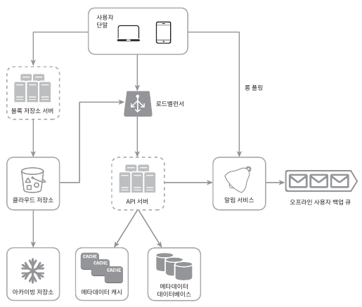

구글 드라이브는 파일 저장 및 동기화 서비스로, 문서, 사진, 비디오, 기타 파일을 클라우드에 보관할 수 있도록 한다.
이 파일은 컴퓨터, 스마트폰, 태블릿 등 어떤 단말에서도 이용 가능해야 한다.
아울러 보관된 파일은 친구, 가족, 동료 들과 손쉽게 공유할 수 있어야 한다.

## 1단계 문제 이해 및 설계 범위 확정
- 지원자: 가장 중요하게 지원해야 할 기능들은 무엇인가요?
- 면접관: 파일 업로드/다운로드, 파일 동기화, 그리고 알림입니다.
- 지원자: 모바일 앱이나 웹 가운데 하나만 지원하면 되나요?
- 면접관: 둘 다 지원해야 합니다.
- 지원자: 파일을 암호화해야 할까요?
- 면접관: 네
- 지원자: 파일 크기에 제한이 있습니까?
- 면접관: 10GB 제한이 있습니다.
- 지원자: 사용자는 얼마나 됩니까?
- 면접관: 일간 능동 사용자(DAU) 기준으로 천만명입니다.

**설계에서 집중할 점**  
- 파일 추가
- 파일 다운로드
- 여러 단말에 파일 동기화
- 파일 갱신 이력 조회
- 파일 공유
- 파일 편집, 삭제, 공유 시 알림

**비-기능적 요구사항**  
- 안정성
- 빠른 동기화 속도
- 네트워크 대역폭
- 규모 확장성
- 높은 가용성

### 개략적 추정치
- 가입 사용자는 오천만명이고 천만 명의 DAU 사용자가 있다고 가정
- 모든 사용자에게 10GB의 무료 저장공간 할당
- 매일 각 사용자가 평균 2개의 파일을 업로드한다고 가정. 각 파일의 평균 크기는 500KB
- 읽기:쓰기 비율은 1:1
- 필요한 저장공간 총량 = 500페타바이트
- 업로드 QPS = 1천만 사용자 * 2회 업로드 /24시간 /3600초 = 약 240
- 최대 QPS = 480

## 2단계 개략적 설계안 제시 및 동의 구하기
서버 한 대로 시작해보자.
- 파일을 올리고 다운로드 하는 과정을 처리할 웹 서버
- 사용자 데이터, 로그인 정보, 파일 정보 등의 메타데이터를 보관할 데이터베이스
- 파일을 저장할 저장소 시스템. 파일 저장을 위해 1TB의 공간을 사용할 것이다.

### API
**1. 파일 업로드 API**  
- 단순 업로드
- 이어 올리기: 파일 사이즈가 크고 네트워크 문제로 업로드가 중단될 가능성이 높다고 생각되면 사용한다.
  - 이어올리기는 다음 세 단계 절차로 이루어진다.
    - 이어 올리기 URL을 받기 위한 최초 요청 전송
    - 데이터를 업로드하고 업로드 상태 모니터링
    - 업로드에 장애가 발생하면 장애 발생시점부터 업로드를 재시작

**2. 파일 다운로드 API**
- 인자
  - path: 다운로드할 파일의 경로

**3. 파일 갱신 히스토리 API**
- 인자
  - path
  - limit: 히스토리 길이의 최대치

지금까지 나열한 모든 API는 HTTPS 프로토콜을 사용해야 한다.
SSLS(Secure Socket Layer)를 지원하는 프로토콜을 이용하는 이유는 클라이언트와 백엔드 서버가 주고받는 데이터를 보호하기 위한 것이다.

### 한 대 서버의 제약 극복
데이터를 샤딩하여 여러 서버에 나누어 저장.
주요 기업들은 저장소로 아마존 S3를 사용한다고 한다.
아마존 S3(Simple Storage Service)는 업계 최고 수준의 규모 확장성, 가용성, 보안, 성능을 제공하는 객체 저장소 서비스다.

S3는 다중화를 지원하는데, 같은 지역 안에서 다중화를 할 수도 있고 여러 지역에 걸쳐 다중화를 할 수도 있다.
AWS 서비스 지역(region)은 아마존 AWS가 데이터 센터를 운영하는 지리적 영역이다.
데이터를 다중화 할 때는 같은 지역 안에서만 할 수도 있고 여러 지역에 걸쳐 할 수도 있다.
여러 지역에 걸쳐 다중화하면 데이터 손실을 막고 가용성을 최대한 보장할 수 있으므로 그렇게 하기로 한다.
S3 버킷은 마치 파일 시스템의 폴더와도 같은 것이다.

- 로드밸런서: 네트워크 트래픽을 분산하기 위해 로드밸런서를 사용한다. 
로드밸런서는 트래픽을 고르게 분산할 수 있을 뿐 아니라, 특정 웹 서버에 장애가 발생하면 자동으로 해당 서버를 우회해준다.
- 웹 서버: 로드밸런서를 추가하면 더 많은 웹 서버를 쉽게 추가할 수 있다.
- 메타데이터 데이터베이스: 데이터베이스를 파일 저장 서버에서 분리하여 SPOF(Single Point of Failure)를 회피한다.
아울러 다중화 및 샤딩 정책을 적용하여 가용성과 규모 확장성 요구사항에 대응한다.
- 파일 저장소: S3를 파일 저장소로 사용하고 가용성과 데이터 무손실을 보장하기 위해 두 개 이상의 지역에 데이터를 다중화한다.

### 동기화 충돌
**개략적 설계안**  

- 블록 저장소 서버(block server): 파일 블록을 클라우드 저장소에 업로드하는 서버다.
블록 저장소는 블록 수준 저장소(block-level storage)라고도 하며, 클라우드 환경에서 데이터 파일을 저장하는 기술이다.
이 저장소는 파일을 여러 개의 블록으로 나눠 저장하며, 각 블록에는 고유한 해시값이 할당된다.
이 해시값은 메타데이터 데이터베이스에 저장된다. 각 블록은 독립적인 객체로 취급되며 클라우드 저장소 시스템에 보관된다.
- 아카이빙 저장소(cold storage): 오랫동안 사용되지 않은 비활성(inactive) 데이터를 저장하기 위한 컴퓨터 시스템이다.
- 알림 서비스: 특정 이벤트가 발생했음을 클라이언트에게 알리는데 쓰이는 발생/구독 프로토콜 기반 시스템이다.
예시 설계안의 경우에는 클라이언트에게 파일이 추가되었거나, 편집되었거나, 삭제되었음을 알려, 파일의 최신 상태를 확인하도록 하는 데 쓰인다.
- 오프라인 사용자 백업 큐(offline backup queue): 클라이언트가 접속 중이 아니라서 파일의 최신 상태를 확일한 수 없을 떄는 해당 정보를 이 큐에 두어 나중에 클라이언트가 접속했을 때 동기화될 수 있도록 한다.

## 3단계 상세 설계
### 블록 저장소 서버
- 델타 동기화(delta sync): 파일이 수정되면 전체 파일 대신 수정이 일어난 블록만 동기화하는 것이다.
- 압축(compression): 압축 알고리즘은 파일 유형에 따라 정한다.

블록 저장소 서버는 파일 업로드에 관계된 힘든 일을 처리하는 컴포넌트다.
클라이언트가 보낸 파일을 블록 단위로 나눠야 하고, 각 블록에 압축 알고리즘을 적용해야 하고, 암호화까지 해야 한다.
아울러 전체 파일을 저장소 시스템으로 보내는 대신 수정된 블록만 전송해야 한다.
- 주어진 파일을 작은 블록들로 분할한다.
- 각 블록을 압축한다.
- 클라우드 저장소로 보내기 전에 암호화한다.
- 클라우드 저장소로 보낸다.

### 높은 일관성 요구사항
강한 일관성(strong consistency) 모델을 기본으로 지원해야 한다.
같은 파일이 단말이나 사용자