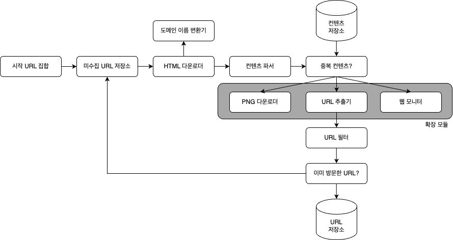

웹 크롤러는 로봇(robot) 또는 스파이더(spider)라고도 부른다.  
검색 엔진에서 널리 쓰는 기술로, 웹에 새로 올라오거나 갱신된 콘텐츠를 찾아내는 것이 주된 목적이다.
여기서 콘텐츠는 웹 페이지일 수도 있고, 이미지나 비디오, 또는 PDF 파일일 수도 있다.

크롤러는 다양하게 이용된다.
- 검색 엔진 인덱싱(search engine indexing): 크롤러의 가장 보편적인 용례다.
크롤러는 웹 페이지를 모아 검색 엔진을 위한 로컬 인덱스(local index)를 만든다.
일례로 Googlebot은 구글(Google) 검색 엔진이 사용하는 웹 크롤러다.
- 웹 아카이빙(web archiving): 나중에 사용할 목적으로 장기보관하기 위해 웹에서 정보를 모으는 절차를 말한다.
많은 국립 도서관이 크롤러를 돌려 웹 사이트를 아카이빙하고 있다.
- 웹 마이닝(web mining): 웹의 폭발적 성장세는 데이터 마이닝(data mining) 업계에 전례 없는 기회다.
웹 마이닝을 통해 인터넷에서 유용한 지식을 도출해 낼 수 있는 것이다.
- 웹 모니터링(web monitoring): 크롤러를 이용하면 인터넷에서 저작권이나 상표권이 침해되는 사례를 모니터링할 수 있다.

## 1단계 문제 이해 및 설계 범위 확정
**웹 크롤러의 기본 알고리즘**  
1. URL 집합이 입력으로 주어지면, 해당 URL들이 가리키는 모든 웹 페이지를 다운로드한다.
2. 다운받은 웹 페이지에서 URL들을 추출한다.
3. 추출된 URL들을 다운로드할 URL 목록에 추가하고 위의 과정을 처음부터 반복한다.

그런데 웹 크롤러가 정말로 이처럼 단순하게 동작할까? 그렇지 않다.  
엄청난 규모 확장성을 갖는 웹 크롤러를 설계하는 것은 엄청나게 어려운 작업이다.
주어진 인터뷰 시간 동안 완성하기는 거의 불가능할 것이다.
그러니 설계를 진행하기 전에 질문을 던져서 요구사항을 알아내고 설계 범위를 좁히자.

- 지원자: 이 크롤러의 주된 용도는 무엇인가요? 검색 엔진 인덱스 생성용인가요? 아니면 데이터 마인이? 아니면 그 외의 다른 용도가 있나요?
- 면접관: 검색 엔진 인덱싱에 쓰일 것입니다.
- 지원자: 매달 얼마나 많은 웹 페이지를 수집해야 하나요?
- 면접관: 10억 개(1bilion)의 웹 페이지를 수집해야 합니다.
- 지원자: 새로 만들어진 웹 페이지나 수정된 웹 페이지도 고려해야 하나요?
- 면접관: 그렇습니다.
- 지원자: 수집한 웹 페이지는 저장해야 합니까?
- 면접관: 네. 5년간 저장해 두어야 합니다.
- 지원자: 중복된 콘텐츠는 어떻게 해야 하나요?
- 면접관: 중복된 콘텐츠를 갖는 페이지는 무시해도 됩니다.

면접관과 크롤러 기능 요구사항을 명확히 하는 한편, 좋은 웹 크롤러가 만족시켜야 할 다음과 같은 속성에 주의를 기울이는 것도 바람직하다.
- 규모 확장성: 웹은 거대하다. 따라서 병행성(parallelism)을 활용하면 보다 효과적으로 웹 크롤링을 할 수 있을 것이다.
- 안정성(robustness): 웹은 함정으로 가득하다. 잘못 작성된 HTML, 아무 반응이 없는 서버, 장애, 악성 코드가 붙어 있는 링크 등이 좋은 예다.
크롤러는 이런 비정상적 입력이나 환경에 잘 대응할 수 있어야 한다.
- 예절(politeness): 크롤러는 수집 대상 웹 사이트에 짧은 시간 동안 너무 많은 요청을 보내서는 안 된다.
- 확장성(extensibility): 새로운 형태의 콘텐츠를 지원하기가 쉬어야 한다. 

### 개략적 규모 추정
- 매달 10억 개의 웹 페이지를 다운로드 한다.
- QPS = 대략 400페이지/초
- 최대 QPS = 2 * QPS = 800
- 웹 페이지의 크기 평균은 500K라고 가정
- 10억 페이지 * 500K = 500TB/월.
- 1개월치 데이터를 보관하는 데는 500TB, 5년간 보관한다고 가정하면 결국 30PB의 저장용량이 필요할 것이다.

## 2단계 개략적 설계안 제시 및 동의 구하기

### 시작 URL 집합
시작 URL 집합은 웹 크롤러가 크롤링을 시작하는 출발점이다.
어떤 대학 웹사이트로부터 찾아 나갈 수 있는 모든 웹 페이지를 크롤링하는 가장 직관적인 방법은 해당 대학의 도메인 이름이 붙은 모든 페이지의 URL을 시작 URL로 쓰는 것이다.

전체 웹을 크롤링해야 하는 경우에는 시작 URL을 고를 떄 좀 더 창의적일 필요가 있다.
크롤러가 가능한 한 만흥ㄴ 링크를 탐색할 수 있도록 하는 URL을 고르는 것이 바람직할 것이다.
일반적으로 전체 URL 공간을 작은 부분집합으로 나누는 전략을 쓴다.

### 미수집 URL 저장소
대부분의 현대적 웹 크롤러는 크롤링 상태를 (1) 다운로드할 URL, 그리고 (2) 다운로드된 URL의 두 가지로 나눠 관리한다.
이 중 '다운로드할 URL'을 저장 관리하는 컴포넌트를 미수집 URL 저장소(URL frontier)라고 부른다.

### HTML 다운로더
HTML 다운로더(downloader)는 인터넷에서 웹 페이지를 다운로드하는 컴포넌트다.
다운로드할 페이지의 URL은 미수집 URL 저장소가 제공한다.

### 도메인 이름 변환기
웹 페이지를 다운받으려면 URL을 IP 주소로 변환하는 절차가 필요하다.
HTML 다운로더는 도메인 이름 변환기를 사용하여 URL에 대응되는 IP 주소를 알아낸다.

### 콘텐츠 파서
웹 페이지를 다운로드하면 파싱(parsing)과 검증(validation) 절차를 거쳐야 한다.
이상한 웹 페이지는 문제를 일으킬 수 있는데다 저장 공간만 낭비하게 되기 때문이다.
크롤링 서버 안에 콘텐츠 파서를 구현하면 크롤링 과정이 느려지게 될 수 있으므로, 독립된 컴포넌트로 만들었다.

### 중복 콘텐츠인가?
웹에 공개된 연구 결과에 따르면, 29% 가량의 웹 페이지 콘텐츠는 중복이다.
본 설계안의 경우, 이 문제를 해결하기 위한 자료 구조를 도입하여 데이터 중복을 줄이고 데이터 처리에 소요되는 시간을 줄인다.
효과적인 비교 방법은 해시 값을 비교하는 것이다.

### 콘텐츠 저장소
콘텐츠 저장소는 HTML 문서를 보관하는 시스템이다.
저장소를 구현하는 데 쓰일 기술을 고를 때는 저장할 데이터의 유형, 크기, 저장소 접근 빈도, 데이터의 유효 기간 등을 종합적으로 고려해야 한다.
본 설계안의 경우에는 디스크와 메모리를 동시에 사용하는 저장소를 택할 것이다.
- 데이터 양이 너무 많으므로 대부분의 콘텐츠는 디스크에 저장한다.
- 인기 있는 콘텐츠는 메모리에 두어 접근 지연시간을 줄일 것이다.

### URL 추출기
URL 추출기는 HTML 페이지를 파싱하여 링크들을 골라내는 역할을 한다.
상대 경로(relative path)는 전부 https://en.wikipedia.org를 붙여 절대 경로(absolute path)로 변환된다.

### URL 필터
URL 필터는 특정한 콘텐츠 타입이나 파일 확장자를 갖는 URL, 접속 시 오류가 발생하는 URL, 접근 제외 목록(deny list)에 포함된 URL 등을 ㅌ크롤링 대상에서 배제하는 역할을 한다.

### 이미 방문한 URL
이 단계를 구현하기 위해서 이미 방문한 URL이나 미수집 URL 저장소에 보관된 URL을 추적할 수 있도록 하는 자료 구조를 사용할 것이다.
해당 자료 구조로는 블룸 필터(bloom filter)나 해시 테이블이 널리 쓰인다.

### URL 저장소
URL 저장소는 이미 방문한 URL을 보관하는 저장소다.

### 웹 크롤러 작업 흐름
1. 시작 URL들을 미수집 URL 저장소에 저장한다.
2. HTML 다운로더는 미수집 URL 저장소에서 URL 목록을 가져온다.
3. HTML 다운로더는 도메인 이름 변환기를 사용하여 URL의 IP 주소를 알아내고, 해당 IP 주소로 접속하여 웹 페이지를 다운받는다.
4. 콘텐츠 파서는 다운도닏 HTML 페이지를 파싱하여 올바른 형식을 갖춘 페이지인지 검증한다.
5. 콘텐츠 파싱과 검증이 끝나면 중복 콘텐츠인지 확인하는 절차를 개시한다.
6. 중복 콘텐츠인지 확인하기 위해서, 해당 페이지가 이미 저장소에 있는지 본다.
7. URL 추출기는 해당 HTML 페이지에서 링크를 골라낸다.
8. 골라낸 링크를 URL 필터로 전달한다.
9. 필터링이 끝나고 남은 URL만 중복 URL 판별 단계로 전달한다.
10. 이미 처리한 URL인지 확인하기 위하여, URL 저장소에 보관된 URL인지 살핀다. 이미 저장소에 있는 URL은 버린다.
11. 저장소에 없는 URL은 URL 저장소에 저장할 뿐 아니라 미수집 URL 저장소에도 전달한다.

## 3단계 상세 설계
- DFS(Depth-First Search) vs BFS(Breadth-First Search)
- 미수집 URL 저장소
- HTML 다운로더
- 안정성 확보 전략
- 확장성 확보 전략
- 문제 있는 콘텐츠 감지 및 회피 전략

### DFS를 쓸 것인가, BFS를 쓸 것인가
웹은 유향 그래프(directed graph)나 같다.
페이지는 노드이고, 하이퍼링크는 엣지라고 보면 된다.
크롤링 프로세스는 이 유향 그래프를 엣지를 따라 탐색하는 과정이다.

DFS는 좋은 선택이 아닐 가능성이 높다. 그래프 크기가 클 경우 어느 정도로 깊숙이 가게 될지 가늠하기 어려워서다.
BFS는 FIFO 큐를 사용하는 알고리즘이다. 하지만 이 구현법에는 다음의 두 가지 문제점이 있다.
- 한 페이지에서 나오는 링크의 상당수는 같은 서버로 되돌아간다. 결국 크롤러는 같은 호스트에 속한 많은 링크를 다운받느라 바빠지게 되는데,
이때 링크들을 병렬로 처리하게 된다면 위키피디아 서버는 숨낳은 요청으로 과부하에 걸리게 될 것이다.
이런 크롤러는 보통 '예의 없는(impolite)' 크롤러로 간주된다.
- 표준적 BFS 알고리즘은 URL 간에 우선순위를 두지 않는다. 처리 순서에 있어 모든 페이지를 공평하게 대우한다는 뜼이다.
하지만 모든 웹 페이지가 같은 수준의 품질, 같은 수준의 중요성을 갖지는 않는다.
그러니 페이지 순위, 사용자 트래픽의 양, 업데이트 빈도 등 여러 가지 척도에 비추어 처리 우선순위를 구별하는 것이 온당할 것이다.

### 미수집 URL 저장소
URL 저장소는 다운로드할 URL을 보관하는 장소다. 이 저장소를 잘 구현하면 '예의(politeness)'를 갖춘 크롤러, URL 사이의 우선순위와 신선도(freshnessA)를 구별하는 크롤러를 구현할 수 있다.

**예의**  
웹 크롤러는 수집 대상 서버로 짧은 시간 안에 너무 많은 요청을 보내는 것을 삼가야 한다.
너무 많은 요청을 보내는 것은 '무례한(impolite)'일이며, 떄로는 DoS(Denial-of-Service) 공격으로 간주되기도 한다.

예의 바른 크롤러를 만드는 데 있어서 지켜야 할 한 가지 원칙은, 동일 웹 사이트에 대해서는 한 번에 한 페이지만 요청한다는 것이다.
같은 웹 사이트의 페이지를 다운받는 태스크는 시간차를 두고 실행하도록 하면 될 것이다.
이 요구사항을 만족시키려면 웹사이트의 호스트명(hostname)과 다운로드를 수행하는 작업 스레드(worker thread) 사이의 관계를 유지하면 된다.
즉, 각 다운로드 스레드는 별도 FIFO 큐를 가지고 있어서, 해당 큐에서 꺼낸 URL만 다운로드 한다.

**우선순위**  
유용성에 따라 URL의 우선순위를 나눌 때는 페이지랭크, 트래픽 양, 갱신 빈도(update frequency) 등 다양한 척도를 사용할 수 있을 것이다.
순위결정장치(prioritizer)는 URL 우선순위를 정하는 컴포넌트다.
- 순위결정장치: URL을 입력으로 받아 우선순위를 계산한다.
- 큐: 우선순위별로 큐가 하나씩 할당된다. 우선순위가 높으면 선택될 확률도 올라간다.
- 큐 선택기: 임의 큐에서 처리할 URL을 꺼내는 역할을 담당한다. 순위가 높은 큐에서 더 자주 꺼내도록 프로그램되어 있다.

**모듈**  
- 전면 큐(front queue): 우선순위 결정 과정을 처리한다.
- 후면 큐(back queue): 크롤러가 예의 바르게 동작하도록 보증한다.

**신선도**  
웹 페이지는 수시로 추가되고, 삭제되고, 변경된다.
따라서 데이터의 신선함을 유지하기 위해서는 이미 다운로드한 페이지라고 해도 주기적으로 재수집(recrawl)할 필요가 있다.
그러나 모든 URL을 재수집하는 것은 많은 시간과 자원이 필요한 작업이다. 이 작업을 최적화하기 위한 전략으로는 다음과 같은 것들이 있다.
- 웹 페이지의 변경 이력(update history) 활용
- 우선순위를 활용하여, 중요한 페이지는 좀 더 자주 재수집

**미수집 URL 저장소를 위한 지속성 저장장치**
검색 엔진을 위한 크롤러의 경우, 처리해야 하는 URL의 수는 수억 개에 달한다.
그러니 그 모두를 메모리에 보관하는 것은 안정성이나 규모 확장성 측면에서 바람직하지 않다.
전부 디스크에 저장하는 것도 좋은 방법은 아닌데, 느려서 쉽게 성능 병목지점이 되기 때문이다.

따라서 절충안을 택한다. 대부분의 URL은 디스크에 두지만 IO 비용을 줄이기 위해 메모리 버퍼에 큐를 두는 것이다.
버퍼에 있는 데이터는 주기적으로 디스크에 기록할 것이다.

### HTML 다운로더
**Robots.txt**  
로봇 제외 프로토콜이라고 부르기도 하는 Robots.txt 는 웹사이트가 크롤러와 소통하는 표준적 방법이다.
이 파일에는 크롤러가 수집해도 되는 페이지 목록이 들어 있다.
따라서 웹 사이트를 긁어 가기 전에 크롤러는 해당 파일에 나열된 규칙을 먼저 확인해야 한다.

이 파일은 주기적으로 다시 다운받아 캐시에 보관할 것이다.

#### 성능 최적화  
**1. 분산 크롤링**  
성능을 높이기 위해 크롤링 작업을 여러 서버에 분산하는 방법이다.
각 서버는 여러 스레드를 돌려 다운로드 작업을 처리한다.
이 구성을 위해 URL 공간은 작은 단위로 분할하여, 각 서버는 그중 일부의 다운로드를 담당하도록 한다.

**2. 도메인 이름 변환 결과 캐시**  
도메인 이름 변환기(DNS Resolver)는 크롤러 성능의 병ㅁ목 중 하나인데, 이는 DNS 요청을 보내고 결과를 받는 작업의 동기적 특성 때문이다.
DNS 요청의 결과를 받기 전까지는 다음 작업을 진행할 수 없는 것이다.
DNS 요청이 처리되는 데는 보통 10ms에서 200ms가 소요된다.
크롤러 스레드 가운데 어느 하나라도 이 작업을 하고 있으면 다른 스레드의 DNS 요청은 전부 블록된다.
따라서 DNS 조회 결과로 얻어진 도메인 이름과 IP 주소 사이의 관계를 캐시에 보관해 놓고 크론 잡(cron job) 등을 돌려 주기적으로 갱신하도록 해 놓으면 성능을 효과적으로 높일 수 있다.

**3. 지역성**  
크롤링 작업을 수행하는 서버를 지역별로 분산하는 방법이다.
지역성을 활용하는 전략은 크롤 서버, 캐시, 큐, 저장소 등 대부분의 컴포넌트에 적용 가능하다.

**4. 짧은 타임아웃**  
어떤 웹 서버는 응답이 느리거나 아예 응답하지 않는다.
이런 경우를 대비해서 최대 얼마나 기다릴지를 미리 정해두는 것이다.

**안정성**  
최적화된 성능뿐 아니라 안정성도 다운로드 설계시 중요하게 고려해야할 부분이다.
- 안정 해시(consistency hashing): 다운로더 서버들에 부하를 분산할 때 적용 가능한 기술이다.
이 기술을 이용하면 다운로더 서버를 쉽게 추가하고 삭제할 수 있다.
- 크롤링 상태 및 수집 데이터 저장: 장애가 발생한 경우에도 쉽게 복구할 수 있도록 크롤링 상태와 수집된 데이터를 지속적 저장장치에 기록해 두는 것이 바람직하다.
저장된 데이터를 로딩하고 나면 중단되었던 크롤링을 쉽게 재시작할 수 있을 것이다.
- 예외 처리(exception handling): 대규모 시스템에서 에러는 불가피할 뿐 아니라 흔하게 벌어지는 일이다.
예외가 발생해도 전체 시스템이 중단되는 일 없이 그 작업을 우아하게 이어나갈 수 있어야 한다.
- 데이터 검증(data validation): 시스템 오류를 방지하기 위한 중요 수단 가운데 하나다.

**확장성**  
진화하지 않는 시스템은 없는 법이라서, 새로운 형태의 콘텐츠를 쉽게 지원할 수 있도록 신경 써야 한다.
본 예제의 경우에는 새로운 모듈을 끼워 넣음으로써 새로운 형태의 콘텐츠를 지원할 수 있도록 설계하였따.

**문제 있는 콘텐츠 감지 및 회피**
**1. 중복 콘텐츠**  
해시나 체크섬을 사용

**2. 거미 덫**  
거미 덫(spider trap)은 크롤러를 무한 루프에 빠뜨리도록 설계한 웹 페이지다.
ex) epidertrapexample.com/foo/bar/foo/bar/foo/bar/foo/bar/...
이런 덫은 URL의 최대 길이를 제한하면 회피할 수 있다.
하지만 가능한 모든 종류의 덫을 피할 수 있는 만능 해결책은 없다.

한 가지 방법은 사람이 수작업으로 덫을 확인하고 찾아낸 후에 덫이 있는 사이트를 크롤러 탐색 대상에서 제외하거나 URL 필터 목록에 걸어두는 것이다.

**3. 데이터 노이즈**  
광고나 스팸 URL 등은 가능하면 제외해야 한다.

## 4단계 마무리
좋은 크롤러가 갖추어야 하는 특성을 살펴보았따.
- 규모 확장성
- 예의
- 확장성
- 안정성

규모 확장성이 뛰어난 웹 크롤러 설계 작업은 단순하지 않다.

**추가 논의점**
- 서버 측 렌더링: 많은 웹사이트가 자바스크립트 등의 기술을 사용해서 링크를 즉석에서 만들어 낸다.
그러니 웹 페이지를 그냥 있는 그대로 다운받아서 파싱해보면 그렇게 동적으로 생성되는 링크는 발견할 수 없을 것이다.
이 문제는 페이지를 파싱하기 전에 서버 측 렌더링을 적용하면 해결할 수 있다.
- 원치 않는 페이지 필터링
- 데이터베이스 다중화 및 샤딩: 데이터 계층의 가용성, 규모 확장성, 안정성이 향상된다.
- 수평적 규모 확장성(horizontal scalability): 수평적 규모 확장성을 달성하는 데 중요한 것은 서버가 상태정보를 유지하지 않도록 하는 것,
즉 무상태(stateless) 서버로 만드는 것이다.
- 가용성, 일관성, 안정성
- 데이터 분석 솔루션

