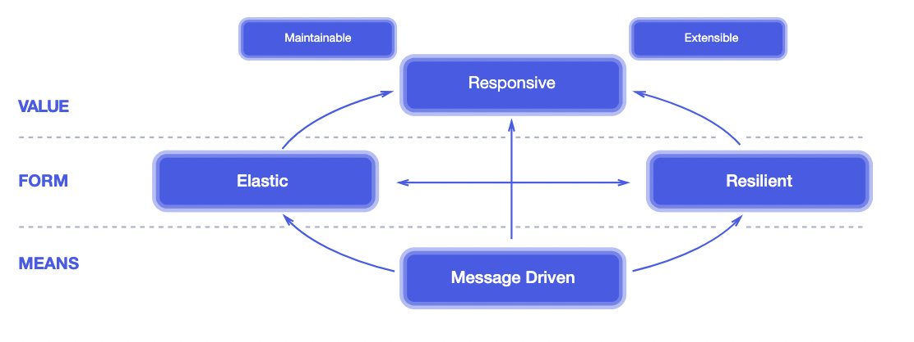

## 1.1 리액티브 시스템(Reactive System)이란?
'reactive'의 사전적 의미에는 '반응을 하는'이라는 뜻이 있습니다.
즉, 어떤 이벤트나 상황이 발생했을 때, 반응을 해서 그에 따라 적절하게 행동하는 것을 의미합니다.

리택이브 시스템에서 반응을 잘한다는 것은 어떤 의미일까요?
-> 클라이언트의 요청에 머뭇거리지 않고 반응을 잘해서 즉시 응답해 주는 것을 의미합니다.
다시 말해서 **클라이언트의 요청에 즉각적으로 응답함으로써 지연 시간을 최소화한다**고도 볼 수 있습니다.

## 1.2 리액티브 선언문으로 리액티브 시스템 이해하기
리액티브 선언문은 리액티브 시스템 구축을 위한 일종의 설계 원칙이자 리액티브 시스템의 특징이라고 할 수 있습니다.
우리는 리액티브 선언문을 통해 리액티브 시스템이 지향하는 바가 무엇인지 명확하게 알 수 있습니다.

- MEANS는 메시지 기반의 통신을 통해서 구성요소들 간의 느슨한 결합, 격리성, 위치 투명성을 보장합니다.
- FORM은 메시지 기반 통신을 통해서 어떠한 형태를 지니는 시스템으로 형성되는지를 나타냅니다.
  - 탄력성(Elastic)이란 시스템의 작업량이 변화하더라도 일정한 응답을 유지하는 것을 의미합니다.
  - 회복성(Resilient)이란 시스템에 장애가 발생하더라도 응답성을 유지하는 것을 의미합니다.
- VALUE는 비동기 메시지 기반 통신을 바탕으로 한 회복성과 예측 가능한 규모 확장 알고리즘을 통해 시스템의 처리량을 자동으로 확장하고 축소하는 탄력성을 확보함으로써 즉각적으로 응답 가능한 시스템을 구축할 수 있음을 의미합니다.

-> 빠른 응답성을 바탕으로 유지보수와 확장이 용이한 시스템

## 1.3 리액티브 프로그램이(Reactive Programming)이란?
리액티브 시스템을 구축하는 데 필요한 프로그래밍 모델

Blocking I/O 방식의 통신에서는 해당 스레드가 작업을 처리할 때까지 남아 있는 작업들은 해당 작업이 끝날 때까지 차단되어 대기합니다.
그렇기 떄문에 뒤에 남아 있는 작업들을 대기 없이 처리하려면 별도의 추가 스레드를 할당해야 해서 그만큼의 비용이 더 들게 됩니다.

Non-Blocking I/O 방식의 통신에서는 말 그대로 스레드가 차단되지 않습니다.

## 1.4 리액티브 프로그래밍의 특징
### 1.4.1 declarative programming
선언형 프로그래밍이라는 의미.
전통적 프로그래밍 방식은 명령형 프로그래밍 -> 실행할 동작을 구체적으로 명시
선언형 프로그래밍은 이러이러한 동작을 하겠다는 목표만 선언합니다.

### 1.4.2 data streams와 the propagation of change
the propagation of change는 지속적으로 데이터가 발생할 때마다 이것을 변화하는 이벤트로 보고, 이 이벤트를 발생시키면서 데이터를 계속적으로 전달하는 것을 의미합니다.

## 1.5 코드로 보는 명령형 프로그래밍 vs 선언형 프로그래밍
### 1.5.1 명령형 프로그래밍
```java
//6보다 크고, 홀수인 숫자들의 합계
var numbers = List.of(1, 3, 21, 10, 8, 11);
int sum = 0;
for(int number : numbers) {
    if(number > 6 && (number % 2 != 0)){
        sum += number;   
    }
}
```

### 1.5.2 선언형 프로그래밍
```java
var numbers = List.of(1, 3, 21, 10, 8, 11);
int sum = numbers.stream()
        .filter(number -> number > 6 && (number % 2 != 0))
        .sum();
```
위 코드는 리액티브 프로그래밍은 아니지만 선언형 프로그래밍 방식의 예를 설명하기 적절한 java의 스트림을 사용했습니다.

'for문을 돌면서 numbers에 하나씩 접근하겠어' 대신
'numbers에 접근 좀 해줘'라고 부탁하는 것과 비슷합니다.

또한 sum이라는 메서드를 선언만하고, 구체적인 숫자를 더하는 동작은 스트림 내부에서 대신 처리

**선언형 프로그래밍 방식의 특징**
- 동작을 구체적으로 명시하지 않고 목표만 선언한다
- 여러 가지 동작을 각각 별도의 코드로 분리하지 않고 각 동작에 대해서 메서드 체인을 형성해서 한 문장으로 된 코드로 구성한다
-> 코드가 간결해져 가독성도 좋아짐
- 선언형 프로그래밍 방식은 함수형 프로그래밍으로 구성된다

## 1.6 리액티브 프로그래밍 코드 구성
**Publisher**
입력으로 들어오는 데이터를 제공하는 역할

**Subscriber**
Publisher가 데이터를 제공하는 역할을 한다면, Subscriber는 Publisher가 제공한 데이터를 전달받아서 사용하는 주체

**Data Source**
Publisher의 입력으로 들어오는 데이터를 대표하는 용어.
리액티브 프로그래밍에선 Data Stream이라고도 표현합니다.

**Operator**
Publisher로부터 전달된 데이터가 순수하게 아무런 처리를 거치지 않고 그대로 Subscriber에 전달되는 경우는 거의 없는데,
사이에서 가공 처리를 담당하는 것이 바로 Operator입니다.