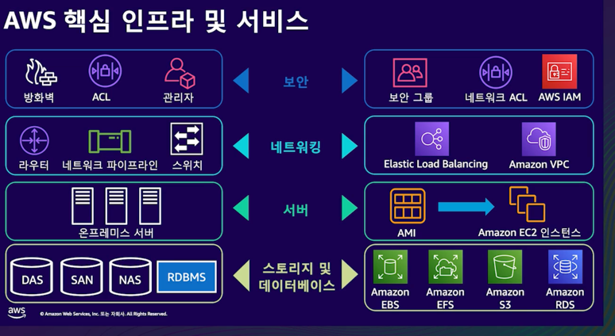

### 클라우드
인터넷을 이용해서 원격 리소스를 사용하는 서비스

클라우드 컴퓨팅에선 인프라를 더 이상 하드웨어라고 생각하지 않고 소프트웨어라고 생각하고 사용할 수 있습니다.

사용량에 따라 비용 지불 -> 효율적.

**장점**
- 선행 비용을 가변 비용으로 대체
- 규모의 경제로 얻게 되는 이점
- 용량 추정 불필요
- 속도와 유연성 향상
- 데이터 센터 운영 및 유지 관리에 대한 부담 감소
- 전 세계적으로 데이터 센터 배포 가능

**리전 선택**
- 데이터 거버넌스
- 지연 시간
- 비용

**엣지 인프라**
클라우드를 엔드포인트로 더 가까이 이동

- AWS Outposts
- AWS Local Zones
- AWS Wavelength

## Amazon Elastic Compute Cloud (EC2)
- 크기 조정 가능한 컴퓨팅 용량
- 컴퓨팅 리소스 완전 제어
- 새로운 서버 인스턴스 확보 및 부팅 시간 단축

**장점**
- 탄력성: 몇분만에 프로비저닝, 시작
- 제어
- 유연성
- 통합
- 안정성
- 안전함
- 비용
- 간편함

AMI라고 부르는 이미지를 기반으로 구성

EC2 요금
- 온디맨드
  - 초나 시간 단위 지불
  - 중단할 수 없는 불규칙한 단기 워크로드가 있는 애플리케이션에 적정
- 예약형
  - 특정 기간 특정 기간
- Savings Plan
  - 정해진 기간 동안 시간당 일정한 금액
- 스팟 인스턴스

**서버리스 컴퓨팅**
시간 당 세 건 정도 들어오는 요청을 처리해야 한다면?  
온디맨드 EC2는 너무 비쌈 -> 서버리스 컴퓨팅

**AWS Lambda**
- 완전 관리형 컴퓨팅 서비스
- Stateless 코드 실행

코드 -> 람다 -> 컨테이너 배포
사용자는 컨테이너를 만들거나 관리하는데 신경 쓸 필요가 없음

### 스토리지
- S3
- S3 Clacier
- EFS
- Storage Gateway
- EBS
- FSx

### S3
객체 수준 스토리지

파일 스토리지와 같은 파일 및 폴더 구조가 사용되지 않고

모든 객체가 수평적 저장.

매우 뛰어난 데이터 내구성 
최소 3개의 가용 영역에 걸쳐 저장.

### Amazon EFS
탄력적인 서버리스 파일 스토리지 제공
